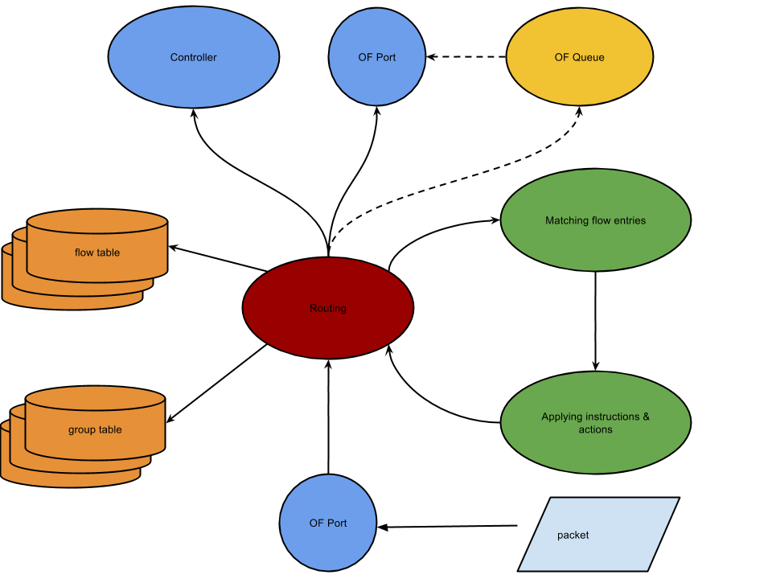

**Table of Contents**

- [Quick Start](#quick-start)
- [LINC-Switch Erlang apps](#linc-switch-erlang-apps)
- [LINC-Switch main dependencies](#linc-switch-main-dependencies)
- [LINC-Switch tests](#linc-switch-tests)
- [LINC-Switch supervision tree](#linc-switch-supervision-tree)
- [linc-Switch backends](#linc-switch-backends)
    - [OpenFlow 1.3 with Optical Extensions](#openflow-1.3-with-optical-extensions)
        - [Multiple ROADMS running on one Erlang node](#multiple-roadms-running-on-one-erlang-node)
        - [Simulated optical ports](#simulated-optical-ports)
        - [Custom OF messages](#custom-of-messages)
- [LINC-Switch packet processing pipeline](#linc-switch-packet-processing-pipeline)
- [LINC-Switch OpenFlow messages processing](#linc-switch-openflow-messages-processing)
        

## Quick Start ##

* [The architecture overview](https://github.com/FlowForwarding/LINC-Switch/blob/master/docs/LINC_Switch_Quick_Start_Guide.pdf)

* [LINC poster with architecture overview](https://github.com/FlowForwarding/incubation/blob/master/papers_presos/FlowForwarding-LINC-poster-final.pdf)

* [Optical Extension description](https://github.com/FlowForwarding/LINC-Switch/blob/master/docs/optical_extension.md)

* [Dealing with packets explanation](https://github.com/FlowForwarding/LINC-Switch/blob/master/docs/packet_capture.md)

* [Configuration (sys.config file) explained](https://github.com/FlowForwarding/LINC-Switch/blob/master/rel/files/sys.config.orig)

* [LINC-Environment to quickly get started and undetstand how the LINC integrates with the OS](https://github.com/FlowForwarding/LINC-Environment](https://github.com/FlowForwarding/LINC-Environment)

## LINC-Switch Erlang apps ##

In the LINC-Switch repository there are 5 [applications](https://github.com/FlowForwarding/LINC-Switch/tree/master/apps):

1. linc

    1. it is always started and provides the root supervisor for the whole application

    2. passes messages between a controller and backends 

    3. implements interface for OF-Config

    4. prepares configuration for the backends

2. Backend applications for specific OpenFlow versions. 

    5. `linc_us3` - backend for OpenFlow 1.2 (wire protocol 0x03)

    6. `linc_us4` - backend for OpenFlow 1.3 (wire protocol 0x04)

    7. ``linc_us4`_oe` - backend for OpenFlow 1.3 with Optical Extensions (wire protocol 0x04)

    8. `linc_us5` - backend for OpenFlow 1.4 (wire protocol 0x05)

## LINC-Switch main dependencies ##

1. [of_protocol](https://github.com/FlowForwarding/of_protocol.git)
an Erlang library for encoding/decoding OpenFlow messages as well
as OpenFlow client

2. [epcap](https://github.com/esl/epcap.git) an Erlang application for
reading packets for eth interfaces

3. [tunctl](https://github.com/msantos/tunctl.git) an Erlang
application for managing TUN/TAP interfaces

4. [procket](https://github.com/msantos/procket) an Erlang library for
socket creation and manipulation

5. [pkt](https://github.com/esl/pkt) an Erlang network protocol library.

## LINC-Switch tests ##

Each backend as well as the linc application have its unit tests.
They can be run using make targets. Each backend target runs tests for
the linc application too:

`make test` (for the newest backend: `linc_us5`)

`make test_us4`

`make test_us4_oe`

`make test_us3` (not all are passing)

## LINC-Switch supervision tree ##

TODO

## LINC-Switch backends ##

### OpenFlow 1.3 with Optical Extensions ###

#### Multiple ROADMS running on one Erlang node ####

Simulating multiple optical switches (ROADMs) within one Erlang node is
achieved by Logical Switches. A Capable Switch can run multiple Logical
Switches. linc_capable_sup module  starts each Logical Switch. It is also
the top supervisor of the whole LINC-Switch application.

#### Simulated optical ports ####

All the other backends read/write packets to either ethernet ports or
TUN/TAP ones via appropriate libraries mentioned in the
[dependencies](#linc-switch-main-dependencies) section. The `linc_us4_oe`
backend supports additional port: simulated optical port. It is entirely
implemented in LINC in the `linc_us4_oe`_optical_native module.

The `linc_us4_oe`_optical_native is a gen_fsm, and it provides a custom
protocol between a pair of optical port so that they can communicate
their state (link_up, link_down, port_up, port_down). linc_oe provides
an API for getting optical peer pid based on SwitchId and PortNo
(the Id unique per Logical Switch).

Similarly as in the case of the other ports, the messages carrying user
data are sent directly to the processes representing OpenFlow ports.
The OpenFlow ports are implemented via ``linc_us4`_oe`_port module. Note,
that this module represent the OpenFlow port regardless of the underlying
"physical port" (eth, TUN/TAP, optical). Each OpenFlow port process is
a gen_server. It receives packets (user data) in handle_info/2 and sends
them by `send/2`. The optical data (packets represented in simulated
optical medium) is represented by Erlang messages and have the following format:

```erlang
OpticalDataMessage :: {optical_data, Pid, Packet}
Pid :: pid() %% pid of the peer simulated optical port (linc_us4_oe_native_optical)
Packet :: [#och_sigid{} | pkt:packet()]
```

#### Custom OF messages ####

The Optical Extension requires custom OpenFlow messages. One example
of such a message is a port description request message containing
all the ports in a Logical Switch (eth, optical…). This request is
implemented as an experimenter one and is handled in the
[linc_us4_oe_port:ofp_experimenter_request/1](https://github.com/FlowForwarding/LINC-Switch/blob/master/apps/linc_us4_oe/src/linc_us4_oe.erl#L431).
Important thing to note is that the name of the function have to match
the name of the record representing the message in the of_protocol (see
[here](https://github.com/FlowForwarding/of_protocol/blob/master/src/ofp_v4_encode.erl#L453).
The functions in the `linc_us4`_oe` are called from the
[linc_logic](https://github.com/FlowForwarding/LINC-Switch/blob/master/apps/linc/src/linc_logic.erl)
module that ties the backend and the OpenFlow client.

## LINC-Switch packet processing pipeline ##

1. Receiving packets

    1. packets are received as Erlang messages and handled in
    `linc_us4_port:handle_info/2`. Depending on the underlying port
    backend (TUN/TAP, eth, optical) the messages have different formats;

    2. based on the port configuration and state (`ofp_port_{config,state}`)
    a packet can be dropped;

    3. if the packet is not dropped it is transformed into the Erlang
    term for easier processing (`linc_us4_packet:binary_to_record/3`);

    4. next the packet is passed to the routing module (by default
    routing takes places in the same process in which the packet had
    been received in the `linc_us4_port` but it is also possible to
    spawn a process for each packet - however it can cause problems)

2. Routing packets

    5. is handled in `linc_us4_routing` module and starts from flow
    table no 0

    6. a packet is matched against flow entries from appropriate flow
    table; flow entries are kept in the ETS tables - the `linc_us4_flow`
    provides an interface for managing flow entries (and flow tables)

    7. if a flow entry matches a packet its instructions are applied
    to the packet (via `linc_us4_instructions:apply/2`)

        1. as a result, actions from *Apply-Actions* instruction *(Action List)*
        or from an *Action Set* can be applied to the packet
        (`linc_us4_actions:apply_set/1` or `linc_us4_actions:apply_list/2`)

        2. also actions from a group’s bucket can be applied
        (`linc_us4_groups` module)

        3. as a result of applying actions, packet can be sent to
        another OpenFlow Port or to a controller

3. Sending packets

    8. packets are sent out the switch via `linc_us4_port:send/2` to:

        4. another OpenFlow port (handled in `linc_us4_port:handle_cast/2`)

        5. flooded to all ports

        6. a controller (packet_in message)

    9. a packet that is to be sent out through an OpenFlow port can be
    sent through a queue via `linc_us4_queue:send/4`

        7. before the packet is sent it is encapsulated by `pkt:encapsulate/1`

        8. before the packet is sent the port is checked whether its
        configuration allows for sending packets

The diagram below illustrates packet processing pipeline:



## LINC-Switch OpenFlow messages processing ##

1. Passing OpenFlow messages to a backend

    1. OpenFlow messages are received and decoded in a process running
    `ofp_client` module (`of_protocol` dependency)

    2. decoded OF messages are sent to the process running the `linc_logic`
    module that passes them to the appropriate backend in the `handle_info/2`

    3. if the backed returns a reply (or replies) they are sent back to
    the `ofp_client` process via `ofp_channel:send/3`;
    the client encodes them and sends to the controller

2. Handling OpenFlow messages by a backend

    4. the backend module is kept in the state of the `linc_logic`
    process and for each OpenFlow messages received from the OF client
    `BackendModule:handle_message/2` is called

    5. the backend module has functions dedicated for each type of an
    OF message which names match the record names of the messages
